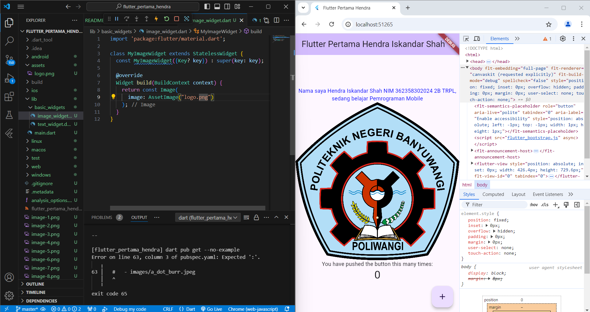

Praktikum 1 :

1. Buka VS Code, lalu klik Command Palette yang di atas, lalu ketik Flutter. Pilih New Application Project.

2. Kemudian buat folder sesuai style laporan praktikum yang kita pilih. Disarankan pada folder alamat folder lain yang tidak terlalu dalam atau panjang. Lalu pilih Select a folder to create the project in.

3. Buat nama project flutter yaitu flutter_pertama_hendra seperti berikut, lalu tekan Enter. Tunggu hingga proses pembuatan project baru selesai.

4. Jika sudah selesai proses pembuatan project baru, maka tampilan akan seperti berikut. Pesan akan tampil berupa "Your Flutter Project is ready!" artinya kita sudah berhasil membuat project Flutter baru.

Praktikum 2 :

1. Login ke akun GitHub kita, kemudian buat repository baru dengan nama "flutter-pertama-hendra"

2. Kemudian klik tombol "Create repository" maka akan tampil seperti gambar berikut.

3. Kembali ke VS code, ke project flutter flutter-pertama-hendra, buka terminal pada menu Terminal > New Terminal. Lalu ketik perintah berikut untuk inisialisasi git pada project kita.

4. Pilih menu Source Control di bagian kiri, kemudian kita melakukan stages (+) pada file .gitignore untuk mengunggah file pertama ke repository GitHub project kita.

5. Beri catatan commit "tambah gitignore" lalu klik Commit (✔)

6. Melakukan push dengan klik bagian menu titik tiga > Push.

7. Di kanan pojok bawah maka akan tampil seperti gambar berikut. Klik "Add Remote".

8. Salin tautan repository Anda dari browser ke bagian ini, lalu klik Add remote

9. Setelah berhasil, tulis remote name dengan "origin"

10. Kembali ke VS Code, ubah platform di pojok kanan bawah ke emulator atau device atau bisa juga menggunakan browser Chrome. Kemudian melakukan running project flutter_pertama_hendra dengan tekan F5 atau Run > Start Debugging. Tunggu proses compile hingga selesai, maka aplikasi flutter pertama kita akan tampil seperti berikut.

Praktikum 3 :

1. Membuat folder baru basic_widgets di dalam folder lib, Kemudian membuat file baru di dalam basic_widgets dengan nama text_widget.dart.

2. Ketik atau salin kode program berikut ini ke project flutter_pertama_hendra kita pada file text_widget.dart.

3. Melakukan import file text_widget.dart ke main.dart, lalu ganti bagian text widget dengan kode di atas. Maka hasilnya seperti gambar berikut. Screenshot hasil milik Anda, lalu dibuat laporan pada file README.md.

4. Buat sebuah file image_widget.dart di dalam folder basic_widgets dengan isi kode berikut.

5. Melakukan penyesuaian asset pada file pubspec.yaml dan tambahkan file logo kita di folder assets project flutter_pertama_hendra.

6. Jangan lupa sesuaikan kode dan import file di main.dart kemudian akan tampil gambar seperti berikut.

Praktikum 4 :

1. Membuat file di basic_widgets > loading_cupertino.dart. Import stateless widget dari material dan cupertino. Kemudian isi kode di dalam method Widget build adalah sebagai berikut.

2. Membuat file di basic_widgets > fab_widget.dart. Import stateless widget dari material. Kemudian isi kode di dalam method Widget build adalah sebagai berikut.

3. Terakhir ubahlah isi main.dart menjadi berikut, maka tampilannya akan menjadi seperti berikut ini.

